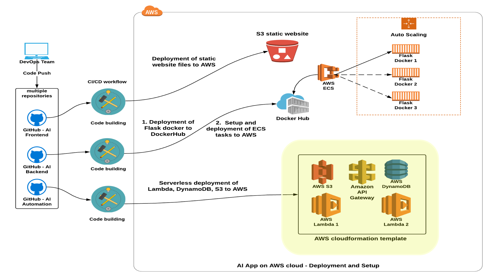

# Udacity Bertelsmann Technical Scholarship Cloud Track Challenge Project - Deploy An AI Sentiment Prediction App to AWS Cloud
 ---
#### _The project was created by 3 scholars from the Cloud Track Challenge_

* [Adrik S](https://github.com/Adriks976) (France)
* [Audrey ST](https://github.com/atan4583) (Australia)
* [Christopher R](https://github.com/christopherrauh) (Germany)

### Repo Information

> * This repo contains the Serverless Framework configuration file **_serverless.yml_** and Lambda function code files for deployment of Lambda functions, their triggering events and required infrastructure resources (DynamoDB, API Gateway and S3) to AWS
>
> * Any changes pushed to the master branch will trigger the Github CI/CD Action on the repo to start serverless deployment of the changes to AWS

### CI/CD Action
> * triggered on push to master branch
>
> * workflow file: .github/workflows/aws.yml
>
> * mandatory enviroment variables
>     - **AWS_ACCESS_KEY**: access-key-id of iam user **_sc-automation_**
>
>     - **AWS_SECRET_ACCESS_KEY**: secret-access-key of iam user **_sc-automation_**
>
> * initiates Serverless Framework to deploy AWS cloudformation template to AWS
>
